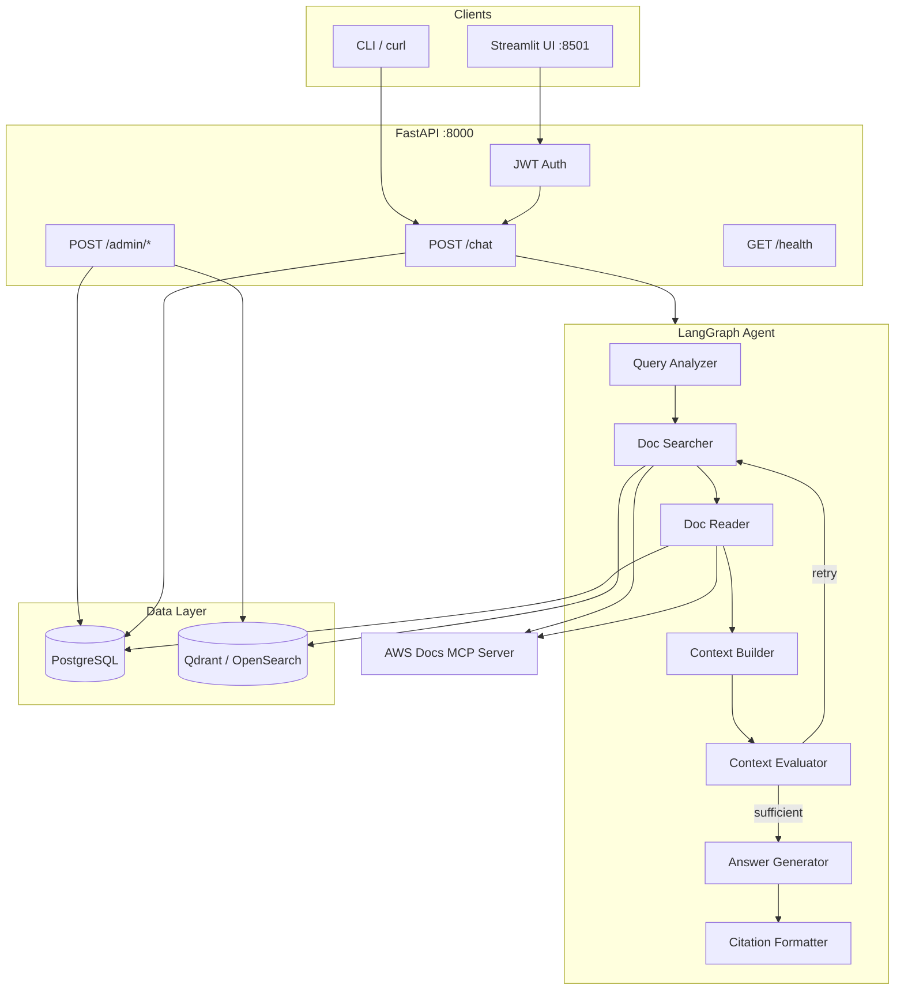

# AWS Documentation Assistant

[](https://github.com/samyak-bhagat/aws_documentation_bot/actions/workflows/ci.yml)
[](https://github.com/samyak-bhagat/aws_documentation_bot/actions/workflows/deploy.yml)


An agentic RAG chatbot that answers questions about AWS services using **only official AWS documentation**, with citations back to the source.

> **Core invariant:** Every answer is grounded in retrieved documentation. The agent never generates answers from parametric memory alone.

---

## Project Overview

### What it does

The AWS Documentation Assistant accepts natural-language questions about AWS services, retrieves relevant content from [docs.aws.amazon.com](https://docs.aws.amazon.com) via the [AWS Documentation MCP Server](https://awslabs.github.io/mcp/servers/aws-documentation-mcp-server), and synthesizes grounded answers with source citations.

### Problem it solves

AWS documentation is vast and constantly updated. Developers need accurate, cited answers without manually searching dozens of pages. This project automates that research loop with a LangGraph agent that searches, reads, evaluates context quality, and generates answers constrained to retrieved content.

### Key features

| Feature | Implementation |
|---------|----------------|
| Grounded answers with citations | LangGraph agent + context-only answer prompt |
| Live AWS docs access | MCP `search_documentation` / `read_documentation` tools |
| Hybrid retrieval (optional) | Vector search (Qdrant or OpenSearch) + BM25 + RRF fusion |
| Document cache | PostgreSQL `doc_cache` with SHA-256 change detection |
| Multi-turn chat | PostgreSQL chat memory keyed by `session_id` |
| Knowledge sync | Daily APScheduler job driven by AWS What's New RSS |
| Authentication | JWT (register / login / refresh) with bcrypt passwords |
| Rate limiting | `slowapi` per-IP limits on `/chat` |
| Web UI | Streamlit chat interface with login and citation display |
| Production deployment | Docker + Terraform (ECS Fargate, RDS, OpenSearch, Bedrock) |

### High-level architecture

```
User → Streamlit UI / REST API
         │
         ▼
    FastAPI (auth, rate limit, lifespan)
         │
         ├── LangGraph Agent (7 nodes + retry loop)
         │     ├── Query Analyzer      (LLM)
         │     ├── Doc Searcher        (hybrid search OR MCP)
         │     ├── Doc Reader          (PG cache → MCP)
         │     ├── Context Builder
         │     ├── Context Evaluator   → retry up to 2×
         │     ├── Answer Generator    (LLM, context-only)
         │     └── Citation Formatter
         │
         ├── PostgreSQL  (doc cache, chat memory, users)
         ├── Qdrant / OpenSearch  (vector index)
         └── AWS Docs MCP Server → docs.aws.amazon.com
```

---

## Architecture Snapshot



Detailed documentation lives in the `docs/` directory:

| Document | Path | Contents |
|----------|------|----------|
| System Architecture | [`docs/system-architecture.md`](docs/system-architecture.md) | Component diagram, data flows, service boundaries |
| API Documentation | [`docs/api.md`](docs/api.md) | Full endpoint reference, request/response schemas, auth |
| AI / RAG Strategy | [`docs/ai-rag-strategy.md`](docs/ai-rag-strategy.md) | Agent graph, retrieval pipeline, prompt strategy |
| Deployment Strategy | [`docs/deployment-strategy.md`](docs/deployment-strategy.md) | Docker Compose, Terraform, ECS, CI/CD |

---

## Tech Stack

| Category | Technologies |
|----------|-------------|
| **Language** | Python 3.12 |
| **Backend** | FastAPI, Uvicorn, Pydantic v2, pydantic-settings, SQLAlchemy 2 (async), asyncpg |
| **AI / LLM** | LangGraph, LangChain, OpenAI GPT-4o (local dev), Amazon Bedrock Claude (production) |
| **Embeddings** | OpenAI `text-embedding-3-small` (dev), Amazon Titan Embed Text v2 (prod) |
| **Knowledge source** | AWS Documentation MCP Server (`awslabs.aws-documentation-mcp-server`) |
| **Vector database** | Qdrant (local), Amazon OpenSearch Service (AWS) |
| **Keyword search** | rank-bm25 (hybrid retrieval) |
| **Database** | PostgreSQL 16 (doc cache, chat memory, users) |
| **Scheduling** | APScheduler (daily knowledge sync at 02:00 UTC) |
| **Authentication** | python-jose (JWT HS256), passlib + bcrypt |
| **Rate limiting** | slowapi |
| **UI** | Streamlit |
| **Cloud services** | AWS ECS Fargate, ECR, RDS, OpenSearch, ALB, VPC, Secrets Manager, Route 53, Bedrock |
| **DevOps** | GitHub Actions (CI + deploy), Docker, Docker Compose |
| **Infrastructure** | Terraform ≥ 1.6 (see [`infra/terraform/README.md`](infra/terraform/README.md)) |
| **Testing** | pytest, pytest-asyncio, pytest-cov |
| **Linting / formatting** | Ruff, MyPy |

---

## Project Structure

```
aws_documentation_bot/
├── apps/
│   ├── api/                    # FastAPI application (v0.8.0)
│   │   ├── main.py             # Lifespan, CORS, rate limiter, router wiring
│   │   ├── schemas.py          # ChatRequest, ChatResponse, HealthResponse
│   │   └── routers/
│   │       ├── chat.py         # POSTING POST /chat — agent invocation
│   │       ├── health.py       # GET /health
│   │       ├── auth.py         # /auth/register, /login, /refresh, /me
│   │       └── admin.py        # POST /admin/sync, /admin/reindex
│   └── ui/
│       └── app.py              # Streamlit chat UI
│
├── agents/
│   ├── graph/
│   │   ├── builder.py          # LangGraph compile + CLI entry point
│   │   └── state.py            # AgentState TypedDict
│   ├── nodes/                  # Seven agent nodes + retry routing
│   └── prompts/                # LLM prompt templates
│
├── services/
│   ├── mcp/                    # AWS Docs MCP client and typed tool wrappers
│   ├── llm/                    # OpenAI / Bedrock LLM factory
│   ├── cache/                  # PostgreSQL document cache (DocCache)
│   ├── memory/                 # Multi-turn chat history
│   ├── vector/                 # Qdrant / OpenSearch client, chunker, indexer, retriever
│   ├── sync/                   # What's New RSS sync pipeline + scheduler
│   └── auth/                   # JWT helpers and User model
│
├── core/
│   ├── config.py               # pydantic-settings (all env vars)
│   ├── database.py             # Async SQLAlchemy engine + init_db
│   └── logging.py              # Structured JSON logger
│
├── tests/unit/                 # 84 unit tests (no live MCP/LLM required)
├── infra/
│   ├── docker/                 # Dockerfile.api, Dockerfile.ui, docker-compose.yml
│   └── terraform/              # AWS infrastructure (VPC, ECS, RDS, OpenSearch, …)
├── scripts/
│   └── check_aws_access.py     # AWS credential sanity check
├── docs/                       # Detailed technical documentation
├── .github/workflows/          # ci.yml (lint, mypy, test, docker build) + deploy.yml
├── .env.example                # Environment variable template
├── requirements.txt
├── pyproject.toml              # Ruff + MyPy + pytest config
├── test_mcp.py                 # Phase 1 MCP smoke test
└── AGENT.md                    # Phase-by-phase development guide
```

---

## Getting Started

### Prerequisites

| Requirement | Notes |
|-------------|-------|
| Python 3.12 | Matches CI and Docker images |
| `uv` / `uvx` | Launches the AWS Docs MCP Server (`pip install uv`) |
| OpenAI API key | Required for local LLM + embeddings |
| Docker + Docker Compose | Optional — runs API, UI, PostgreSQL, and Qdrant together |
| PostgreSQL | Required for auth, chat memory, and doc cache via the API |

### Installation

```powershell
# Clone and enter the repo
cd aws_documentation_bot

# Create virtual environment
py -3.12 -m venv .venv
.venv\Scripts\activate          # Windows
# source .venv/bin/activate     # Linux / macOS

# Install dependencies
pip install -r requirements.txt
pip install uv                  # provides uvx for the MCP server

# Configure environment
copy .env.example .env          # Windows
# cp .env.example .env          # Linux / macOS
# Edit .env — at minimum set OPENAI_API_KEY
```

### Environment variables

Copy [`.env.example`](.env.example) to `.env`. See [Configuration](#configuration) for the full reference.

### Local development setup

**Minimal (agent CLI only — no database, no auth):**

```powershell
python -m agents.graph.builder "What are Lambda timeout limits?"
```

**Full stack with Docker Compose:**

```powershell
cd infra/docker
docker compose up --build
```

This starts:

| Service | URL |
|---------|-----|
| API | http://localhost:8000 |
| Streamlit UI | http://localhost:8501 |
| PostgreSQL | localhost:5432 |
| Qdrant | http://localhost:6333 |

Register a user via the UI or `POST /auth/register`, then chat through the UI or API.

**API only (manual PostgreSQL):**

```powershell
uvicorn apps.api.main:app --host 0.0.0.0 --port 8000 --reload
```

**Streamlit UI (API must be running):**

```powershell
$env:API_URL = "http://localhost:8000"
streamlit run apps/ui/app.py
```

### Running the application

```powershell
# Health check
curl http://localhost:8000/health

# Register (requires DATABASE_URL)
curl -X POST http://localhost:8000/auth/register `
  -H "Content-Type: application/json" `
  -d '{"email": "dev@example.com", "password": "secret123"}'

# Login
curl -X POST http://localhost:8000/auth/login `
  -H "Content-Type: application/json" `
  -d '{"email": "dev@example.com", "password": "secret123"}'

# Chat (Bearer token required)
curl -X POST http://localhost:8000/chat `
  -H "Content-Type: application/json" `
  -H "Authorization: Bearer <access_token>" `
  -d '{"query": "How do I secure an S3 bucket?"}'
```

### Running tests

```powershell
# Unit tests (84 tests — no MCP / LLM / DB required)
pytest tests/unit/ -v

# With coverage (matches CI)
pytest tests/unit/ -v --cov=. --cov-report=term-missing

# MCP smoke test (requires live MCP server + network)
python test_mcp.py
```

### Linting

```powershell
ruff check .
mypy services/ agents/ apps/ core/ --ignore-missing-imports
```

### Formatting

```powershell
ruff format .
ruff format --check .    # CI mode — verify without writing
```

### Docker

```powershell
# Build API image
docker build -f infra/docker/Dockerfile.api -t aws-docs-api .

# Build UI image
docker build -f infra/docker/Dockerfile.ui -t aws-docs-ui .

# Full local stack
cd infra/docker
docker compose up --build
```

---

## Configuration

All settings are loaded from environment variables via `core/config.py` (pydantic-settings). Values in `.env` override defaults.

### Required for local development

| Variable | Default | Description |
|----------|---------|-------------|
| `OPENAI_API_KEY` | *(empty)* | OpenAI API key for LLM and embeddings |
| `OPENAI_MODEL` | `gpt-4o` | Chat model for agent nodes |
| `MCP_SERVER_COMMAND` | `uvx` | Executable to launch the MCP server |
| `MCP_SERVER_ARGS` | `awslabs.aws-documentation-mcp-server@latest` | MCP server package |

### Optional — enable progressively

| Variable | Default | Description |
|----------|---------|-------------|
| `DATABASE_URL` | *(empty)* | PostgreSQL async URL (`postgresql+asyncpg://…`). Enables auth, cache, memory |
| `QDRANT_URL` | *(empty)* | Qdrant HTTP endpoint (e.g. `http://localhost:6333`) |
| `QDRANT_COLLECTION` | `aws_docs` | Qdrant collection name |
| `OPENSEARCH_ENDPOINT` | *(empty)* | OpenSearch domain URL — overrides Qdrant when set |
| `OPENSEARCH_INDEX` | `aws_docs` | OpenSearch index name |
| `OPENSEARCH_USERNAME` | *(empty)* | OpenSearch fine-grained access user |
| `OPENSEARCH_PASSWORD` | *(empty)* | OpenSearch password |
| `JWT_SECRET` | `change-me-in-production` | HS256 signing secret — **change in production** |
| `JWT_ALGORITHM` | `HS256` | JWT algorithm |
| `JWT_EXPIRE_MINUTES` | `60` | Access token lifetime |
| `DOC_CACHE_TTL_HOURS` | `24` | Doc cache TTL |
| `MAX_CONTEXT_MESSAGES` | `10` | Multi-turn history window |
| `RATE_LIMIT_PER_MINUTE` | `20` | Per-IP rate limit on `/chat` |

### Production (AWS / ECS)

| Variable | Default | Description |
|----------|---------|-------------|
| `AWS_REGION` | `us-east-1` | AWS region for Bedrock and OpenSearch |
| `BEDROCK_MODEL_ID` | *(empty)* | When set, switches LLM from OpenAI to Bedrock |
| `BEDROCK_EMBED_MODEL_ID` | `amazon.titan-embed-text-v2:0` | Bedrock embedding model |

When `BEDROCK_MODEL_ID` is set, the LLM factory uses Amazon Bedrock instead of OpenAI. When `OPENSEARCH_ENDPOINT` is set, vector search uses OpenSearch instead of Qdrant.

### Configuration files

| File | Purpose |
|------|---------|
| `.env` | Local secrets and overrides (never commit) |
| `.env.example` | Documented template for all variables |
| `pyproject.toml` | Ruff, MyPy, and pytest settings |
| `infra/docker/docker-compose.yml` | Local multi-service stack |
| `infra/terraform/environments/dev/terraform.tfvars` | AWS infrastructure variables |

### Secrets required

| Secret | Where |
|--------|-------|
| `OPENAI_API_KEY` | `.env` (local), GitHub Actions secret (CI), Secrets Manager (ECS) |
| `JWT_SECRET` | `.env` / Secrets Manager — use a strong random value in production |
| `DATABASE_URL` | `.env` / Secrets Manager (includes DB password) |
| `OPENSEARCH_PASSWORD` | `.env` / Secrets Manager |
| `AWS_ROLE_ARN` | GitHub Actions secret (OIDC deploy role) |

Never commit `.env`, `*accessKeys*.csv`, or `terraform.tfvars` — all are in `.gitignore`.

---

## API Overview

| Method | Path | Auth | Description |
|--------|------|------|-------------|
| `GET` | `/health` | None | Liveness check; reports MCP connection status |
| `POST` | `/auth/register` | None | Create user account (requires PostgreSQL) |
| `POST` | `/auth/login` | None | Returns access + refresh JWT pair |
| `POST` | `/auth/refresh` | None | Exchange refresh token for new pair |
| `GET` | `/me` | Bearer | Current user profile |
| `POST` | `/chat` | Bearer | Run research agent; returns answer + citations |
| `POST` | `/admin/sync` | Admin | Trigger knowledge sync pipeline |
| `POST` | `/admin/reindex` | Admin | Re-index cached docs into vector store |

**`POST /chat` response shape:**

```json
{
  "answer": "To secure an S3 bucket...",
  "sources": [{ "title": "S3 Security Best Practices", "url": "https://docs.aws.amazon.com/..." }],
  "session_id": "uuid",
  "latency_ms": 4250.0
}
```

Full endpoint documentation, error codes, and auth flows: [`docs/api.md`](docs/api.md)

Interactive API docs (when server is running): http://localhost:8000/docs

---

## AI / RAG Overview

The research agent is a compiled LangGraph `StateGraph` with seven nodes and a conditional retry loop:

1. **Query Analyzer** — LLM extracts AWS service and intent; produces an optimized search query.
2. **Doc Searcher** — Hybrid vector + BM25 search when the index is populated; otherwise MCP keyword search.
3. **Doc Reader** — Fetches full page content from PostgreSQL cache or MCP (top 3 results).
4. **Context Builder** — Merges and deduplicates document sections.
5. **Context Evaluator** — Checks sufficiency; triggers up to 2 query-broadening retries.
6. **Answer Generator** — LLM synthesizes an answer using **only** the retrieved context.
7. **Citation Formatter** — Attaches source titles and URLs.

LLM provider is selected automatically: OpenAI locally, Amazon Bedrock when `BEDROCK_MODEL_ID` is set.

Detailed retrieval strategy, chunking, indexing, and prompt design: [`docs/ai-rag-strategy.md`](docs/ai-rag-strategy.md)

---

## Deployment

| Environment | Method | Documentation |
|-------------|--------|---------------|
| Local | Docker Compose (`infra/docker/docker-compose.yml`) | [Getting Started](#getting-started) |
| AWS (dev) | Terraform + ECS Fargate | [`infra/terraform/README.md`](infra/terraform/README.md) |
| CI/CD | GitHub Actions on push to `main` | [`docs/deployment-strategy.md`](docs/deployment-strategy.md) |

**CI pipeline** (`.github/workflows/ci.yml`): Ruff lint → Ruff format check → MyPy → pytest with coverage → Docker build.

**Deploy pipeline** (`.github/workflows/deploy.yml`): lint + test → build and push API/UI images to ECR → force ECS rolling deployment. Requires GitHub secret `AWS_ROLE_ARN` (Terraform OIDC output).

Production stack: ECS Fargate (API + Streamlit UI) behind an ALB, RDS PostgreSQL 16, Amazon OpenSearch, ECR, Secrets Manager, and Bedrock for LLM/embeddings.

---

## Development Workflow

### Creating feature branches

```powershell
git checkout main
git pull
git checkout -b feature/your-feature-name
```

### Before opening a pull request

```powershell
ruff check .
ruff format .
mypy services/ agents/ apps/ core/ --ignore-missing-imports
pytest tests/unit/ -v
```

### Pull request process

1. Open a PR targeting `main`.
2. CI must pass: lint, format check, MyPy, unit tests, and Docker build.
3. Keep changes focused; match existing code style and module layout.
4. Do not commit secrets (`.env`, access key CSVs, `terraform.tfvars`).

### CI/CD overview

| Workflow | Trigger | Jobs |
|----------|---------|------|
| `ci.yml` | Push / PR to `main` | lint → type-check → test → docker-build |
| `deploy.yml` | Push to `main` / manual dispatch | test → build-and-push (ECR) → deploy (ECS) |

GitHub secret required for CI tests: `OPENAI_API_KEY`. For deploy: `AWS_ROLE_ARN`.

---

## Documentation

```
docs/
├── system-architecture.md   # Components, data flows, caching, and service boundaries
├── api.md                   # Full REST API reference with auth and admin endpoints
├── ai-rag-strategy.md       # LangGraph agent, hybrid retrieval, prompts, and indexing
└── deployment-strategy.md   # Docker Compose, Terraform, ECS, secrets, and CI/CD
```

| Document | Description |
|----------|-------------|
| [`docs/system-architecture.md`](docs/system-architecture.md) | End-to-end system design — API layer, agent, data stores, and MCP integration |
| [`docs/api.md`](docs/api.md) | Complete API contracts, authentication flows, rate limits, and error handling |
| [`docs/ai-rag-strategy.md`](docs/ai-rag-strategy.md) | Agent graph topology, retrieval pipeline (vector + BM25 + RRF), and LLM provider switching |
| [`docs/deployment-strategy.md`](docs/deployment-strategy.md) | Local Docker setup, AWS Terraform provisioning, and GitHub Actions deployment |
| [`infra/terraform/README.md`](infra/terraform/README.md) | Step-by-step AWS infrastructure bootstrap and cost estimates |
| [`AGENT.md`](AGENT.md) | Phase-by-phase development history and implementation checklist |

---

## Future Improvements

Based on the current codebase, these are the highest-value next steps:

| Area | Recommendation |
|------|----------------|
| **Observability** | Add OpenTelemetry tracing and Prometheus metrics (referenced in `AGENT.md` but not yet implemented) |
| **Database migrations** | Replace `create_all()` with Alembic migrations (Alembic is in `requirements.txt` but unused) |
| **Integration tests** | Add `tests/integration/` for MCP, PostgreSQL, and Qdrant (directories planned in `AGENT.md`) |
| **Dev ergonomics** | Optional auth bypass flag for local API development without PostgreSQL |
| **OpenSearch sync** | Extend sync pipeline indexing to OpenSearch (currently Qdrant-focused in scheduler) |
| **Health checks** | Expand `/health` to report DB, vector store, and scheduler status |
| **License** | Add a root `LICENSE` file for open-source distribution |

---

## License

No license file is present in the repository yet. Add one before public distribution.
