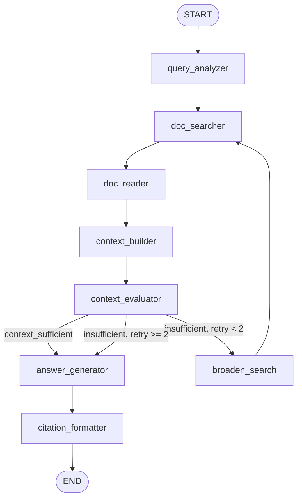
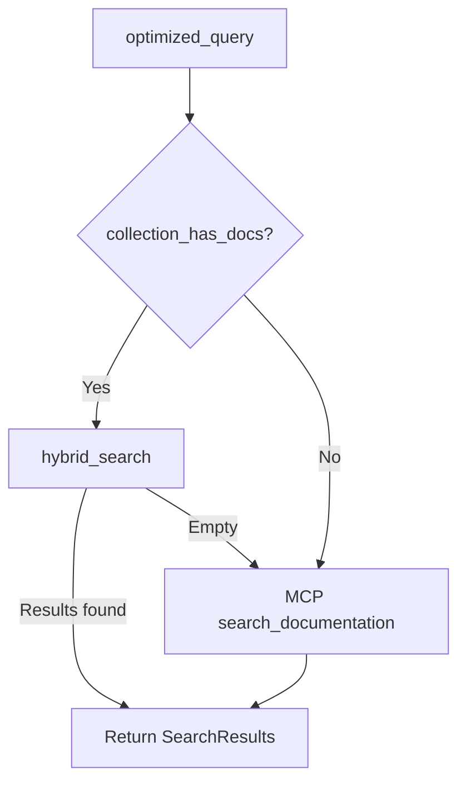
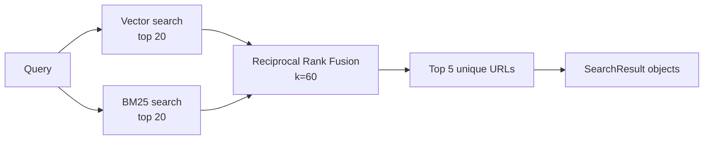

# AI / RAG Strategy

This document describes how the AWS Documentation Assistant retrieves, evaluates, and generates answers — derived entirely from the implementation in `agents/` and `services/vector/`.

---

## Design Principles

1. **Grounded generation only** — The answer prompt explicitly forbids using knowledge outside the retrieved context.
2. **Live docs as source of truth** — MCP connects to the official AWS Documentation MCP Server, which reads from `docs.aws.amazon.com`.
3. **Progressive enhancement** — Vector search, PostgreSQL cache, and sync are optional layers that improve latency and recall without changing the core invariant.
4. **Graceful fallback** — Each enhancement layer fails open: hybrid search → MCP search; DB cache → in-memory cache → MCP read.

---

## LangGraph Agent

### Graph Topology

Compiled in `agents/graph/builder.py`:



### Agent State

Defined in `agents/graph/state.py` as a `TypedDict`:

| Field | Set by | Purpose |
|-------|--------|---------|
| `user_query` | Input | Original user question |
| `session_id` | Input | Conversation session UUID |
| `aws_service` | query_analyzer | Extracted service (e.g. `"s3"`) |
| `user_intent` | query_analyzer | Intent (e.g. `"security"`) |
| `optimized_query` | query_analyzer | Rewritten search query |
| `search_results` | doc_searcher | Serialised `SearchResult` dicts |
| `documents` | doc_reader | Full page content dicts |
| `context` | context_builder | Merged context string for LLM |
| `answer` | answer_generator | Generated answer text |
| `citations` | citation_formatter | `{title, url}` list |
| `retry_count` | query_analyzer / broaden_search | Retry counter (max 2) |
| `context_sufficient` | context_evaluator | Whether context meets threshold |

---

## Node Reference

### 1. Query Analyzer

**File:** `agents/nodes/query_analyzer.py`

Uses the LLM with **structured output** (`with_structured_output`) to extract:

- `aws_service` — lowercase short name or `"general"`
- `user_intent` — e.g. `"security"`, `"setup"`, `"pricing"`
- `optimized_query` — technical search phrase for documentation lookup

**Prompt:** `agents/prompts/query_analysis.txt`

Resets retrieval state on each analysis: `retry_count=0`, empty search results and documents.

### 2. Doc Searcher

**File:** `agents/nodes/doc_searcher.py`

Two-tier retrieval strategy:



| Mode | Trigger | Implementation |
|------|---------|----------------|
| **Hybrid search** | Vector index has documents | `services/vector/retriever.py` → `hybrid_search()` |
| **MCP fallback** | Index empty or hybrid fails | `AWSDocsMCPTools.search_documentation()` |

Search limit: **5 results** (`_SEARCH_LIMIT = 5`).

The service name from query analysis is **not** used as a hard filter — semantic search handles relevance.

### 3. Doc Reader

**File:** `agents/nodes/doc_reader.py`

Reads full content for the **top 3** search results with URLs.

**Cache hierarchy:**

1. PostgreSQL `DocCacheRepository` (if DB session provided and entry is within TTL)
2. In-memory `_page_cache` dict (process-scoped)
3. MCP `read_documentation(url, max_length=8000)`

On MCP fetch with DB available: upserts to PostgreSQL and populates in-memory cache.

### 4. Context Builder

**File:** `agents/nodes/context_builder.py`

Merges documents into a single context string:

- Deduplicates by URL
- Caps each document at **3,000 characters**
- Hard cap total context at **12,000 characters** (truncates with `[Context truncated]` marker)
- Format: `### {title}\nSource: {url}\n\n{content}` separated by `---`

### 5. Context Evaluator

**File:** `agents/nodes/context_evaluator.py`

Simple heuristic: context is **sufficient** if length ≥ **300 characters** (`_MIN_CONTEXT_CHARS`).

No LLM call — keeps evaluation fast and deterministic.

### 6. Broaden Search (retry node)

**File:** `agents/graph/builder.py` → `_make_broaden_search_node()`

When context is insufficient and `retry_count < 2`:

- Appends broadening suffix to query: `"overview guide"`, `"best practices documentation"`, or `"AWS official guide"`
- Increments `retry_count`
- Clears search results, documents, and context
- Routes back to `doc_searcher`

After 2 retries, proceeds to answer generator with whatever context exists (fallback path).

### 7. Answer Generator

**File:** `agents/nodes/answer_generator.py`

**Prompt:** `agents/prompts/answer_generation.txt`

Key constraints enforced in prompt:

- Answer **only** from provided context
- Do not invent AWS features or limits
- Return exact fallback string if context is insufficient
- Cite source pages

If context is empty, returns immediately without LLM call:

```
"I could not find this information in the AWS documentation provided."
```

**Temperature:** 0 (set in LLM factory).

### 8. Citation Formatter

**File:** `agents/nodes/citation_formatter.py`

Builds deduplicated `{title, url}` list from documents read (not from LLM output). Uses document title or URL as fallback title.

---

## LLM Provider Selection

**File:** `services/llm/factory.py`

| Condition | Provider | Model |
|-----------|----------|-------|
| `BEDROCK_MODEL_ID` set | `ChatBedrock` (langchain-aws) | Value of `BEDROCK_MODEL_ID` |
| Default (local dev) | `ChatOpenAI` | `OPENAI_MODEL` (default `gpt-4o`) |

Both providers use `temperature=0`.

**Used in:**

- Query analyzer (structured output)
- Answer generator (free-form text)

---

## Embedding Strategy

**File:** `services/vector/embedder.py`

| Condition | Provider | Model | Dimensions |
|-----------|----------|-------|------------|
| `use_bedrock` | Bedrock Runtime | `BEDROCK_EMBED_MODEL_ID` (default Titan v2) | 1024 |
| Default | OpenAI | `text-embedding-3-small` | 1536 |

Batch size: 100 texts per OpenAI request with 100ms delay between batches.

Used by: vector indexer, hybrid retriever (query embedding).

---

## Vector Indexing Pipeline

### Chunking

**File:** `services/vector/chunker.py`

| Parameter | Value |
|-----------|-------|
| Max chunk size | 1,000 tokens (~4,000 chars) |
| Overlap | 150 tokens (~600 chars) |
| Section detection | Markdown headings (`#`–`####`) or ALL-CAPS lines |

Each chunk carries: `text`, `section`, `url`, `title`, `service_name`, `hash`, `chunk_index`.

Service name is inferred from URL path (e.g. `docs.aws.amazon.com/AmazonS3/...` → `s3`).

### Indexing

**File:** `services/vector/indexer.py`

1. Chunk document via `chunk_document()`
2. Embed all chunk texts via `embed_texts()`
3. Upsert to Qdrant or OpenSearch in batches of 50

**Chunk ID:** UUID5 derived from `{url}#{chunk_index}` (deterministic, idempotent re-index).

**Triggers:**

- Knowledge sync pipeline (after cache upsert)
- `POST /admin/reindex` (bulk re-index from PostgreSQL)

### Vector Store Backends

**Facade:** `services/vector/store.py`

| Backend | Init function | Collection/index | Vector size |
|---------|---------------|------------------|-------------|
| Qdrant | `init_qdrant()` | `aws_docs` | 1536 (cosine) |
| OpenSearch | `init_opensearch()` | `aws_docs` | 1024 (HNSW, faiss) |

OpenSearch takes precedence when `OPENSEARCH_ENDPOINT` is set.

---

## Hybrid Retrieval

**File:** `services/vector/retriever.py`

### Pipeline



### Vector search

| Backend | Method |
|---------|--------|
| Qdrant | `query_points()` with embedded query vector |
| OpenSearch | k-NN query on `embedding` field |

Optional filter: `service_name` (not used by doc searcher currently).

### BM25 search

| Backend | Method |
|---------|--------|
| Qdrant | Scroll up to 2,000 points, in-memory `BM25Okapi` scoring |
| OpenSearch | Native `match` query on `chunk_text` |

### Reciprocal Rank Fusion (RRF)

```python
score(key) += 1 / (k + rank + 1)   # k = 60
```

Merges vector and BM25 ranked lists. Deduplicates by URL in final output. Returns up to **5** `SearchResult` objects with title, URL, and 300-char excerpt.

---

## Knowledge Sync (Index Population)

**File:** `services/sync/scheduler.py`

The vector index is populated incrementally by the sync pipeline, not by bulk ingestion at startup:

1. Parse AWS What's New RSS (`services/sync/whats_new.py`)
2. Map headlines to service names via keyword dictionary (~40 services)
3. MCP search per service → read top 3 pages
4. SHA-256 hash compare against PostgreSQL cache
5. On change: upsert cache + index into Qdrant (if client initialised)

**Schedule:** Daily at 02:00 UTC via APScheduler.

**Note:** Sync indexing currently checks Qdrant client directly. OpenSearch indexing works via `index_document()` when `use_opensearch` is true, but the sync scheduler's Qdrant-specific check may skip indexing on OpenSearch-only deployments until `/admin/reindex` is called.

---

## Multi-Turn Conversations

When PostgreSQL is available (`apps/api/routers/chat.py`):

1. Load recent messages via `ChatMemoryRepository.format_history(session_id)`
2. Prepend history to query:
   ```
   [Previous conversation]
   User: ...
   Assistant: ...

   [New question]
   {current query}
   ```
3. After agent completes, persist user message and assistant response (with citations and latency)

History window: `MAX_CONTEXT_MESSAGES` (default 10).

---

## Prompt Templates

### Query Analysis (`agents/prompts/query_analysis.txt`)

Instructs the LLM to extract AWS service, intent, and an optimised search query. Output schema enforced via Pydantic structured output (`_QueryAnalysis`).

### Answer Generation (`agents/prompts/answer_generation.txt`)

Strict rules:

- Context-only answers
- Exact fallback string when insufficient
- Cite sources
- Concise, structured formatting (bullets/steps)

Context is wrapped in explicit delimiters:
```
--- DOCUMENTATION CONTEXT START ---
{context}
--- DOCUMENTATION CONTEXT END ---
```

---

## Performance Characteristics

| Stage | Typical bottleneck |
|-------|-------------------|
| Query analysis | 1 LLM call (~1–2s) |
| Hybrid search | Embedding + vector query (~0.5–1s) |
| MCP search (fallback) | Subprocess IPC + network (~2–5s) |
| Doc reading | Cache hit: ms; MCP: ~1–3s per page × 3 |
| Context evaluation | Instant (heuristic) |
| Answer generation | 1 LLM call (~2–5s) |
| Retry loop | Up to 2 additional search+read cycles |

Reported in API response as `latency_ms`.

---

## CLI Usage (No API)

Run the agent directly without auth or database:

```powershell
python -m agents.graph.builder "How do I secure an S3 bucket?"
```

Uses `get_mcp_client()` context manager — connects and disconnects MCP per invocation.

---

## Related Documentation

- [System Architecture](system-architecture.md)
- [API Documentation](api.md)
- [Deployment Strategy](deployment-strategy.md)
