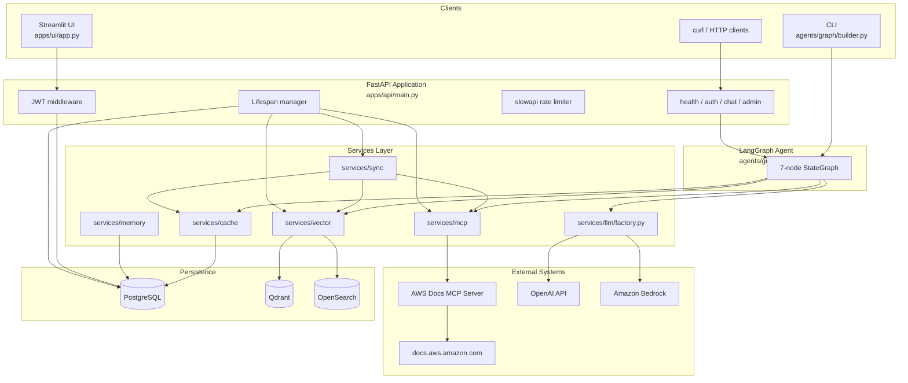
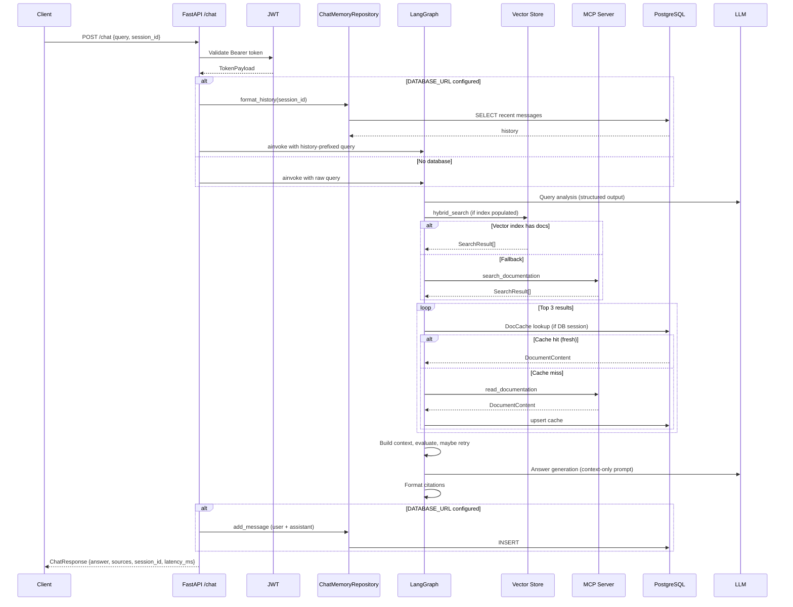

# System Architecture

This document describes the AWS Documentation Assistant as implemented in the repository. All components, data flows, and boundaries reflect the current code — not a planned or aspirational design.

---

## Purpose

The system answers natural-language questions about AWS services using **only official AWS documentation**, with citations back to source pages.

**Core invariant:** Every answer is grounded in retrieved documentation. The LLM never answers from parametric memory alone.

---

## Component Overview



---

## Application Layers

### 1. Client Layer

| Client | Entry point | Notes |
|--------|-------------|-------|
| **Streamlit UI** | `apps/ui/app.py` | Login/register flow, multi-turn chat, citation display. Calls API at `API_URL` (default `http://localhost:8000`). |
| **REST API** | `apps/api/main.py` | FastAPI v0.8.0. All `/chat` and `/admin` routes require JWT. |
| **CLI** | `python -m agents.graph.builder` | Runs agent directly with MCP; no auth or PostgreSQL required. |

### 2. API Layer (`apps/api/`)

**Lifespan** (`main.py`) initialises resources on startup and tears them down on shutdown:

| Resource | Condition | Behaviour on failure |
|----------|-----------|----------------------|
| PostgreSQL | `DATABASE_URL` set | Creates tables via `init_db()`; sets `app.state.db_available` |
| Vector store | `OPENSEARCH_ENDPOINT` or `QDRANT_URL` set | Calls `init_vector_store()`; sets `app.state.vector_available` |
| MCP session | Always attempted | Single shared session; sets `app.state.mcp_connected` |
| Sync scheduler | After MCP connects | APScheduler daily job at 02:00 UTC |

**Middleware and cross-cutting concerns:**

- **CORS** — Allows `http://localhost:8501` (Streamlit).
- **Rate limiting** — Global default `200/minute`; `/chat` has per-route limit from `RATE_LIMIT_PER_MINUTE` (default 20).
- **Structured logging** — JSON logs via `core/logging.py`.

**Routers:**

| Router | Prefix | Purpose |
|--------|--------|---------|
| `health.py` | `/health` | Liveness; reports MCP connection status |
| `auth.py` | `/auth` | Register, login, refresh, `/me` |
| `chat.py` | `/chat` | Agent invocation with optional session memory |
| `admin.py` | `/admin` | Manual sync and reindex (admin JWT required) |

### 3. Agent Layer (`agents/`)

A compiled LangGraph `StateGraph` orchestrates the research loop. State is defined in `agents/graph/state.py` as a `TypedDict` with fields for query analysis, retrieval, generation, and retry control.

See [AI / RAG Strategy](ai-rag-strategy.md) for the full graph topology.

### 4. Services Layer (`services/`)

| Module | Responsibility |
|--------|----------------|
| `mcp/` | Stdio MCP client lifecycle; typed wrappers for AWS Docs tools |
| `llm/` | Factory selecting OpenAI (dev) or Bedrock (prod) |
| `cache/` | PostgreSQL document cache with SHA-256 hashing and TTL |
| `memory/` | Multi-turn chat session and message persistence |
| `vector/` | Chunking, embedding, indexing, hybrid retrieval (Qdrant or OpenSearch) |
| `sync/` | What's New RSS pipeline and APScheduler integration |
| `auth/` | JWT creation/validation, bcrypt password hashing, User model |

### 5. Core Layer (`core/`)

| Module | Responsibility |
|--------|----------------|
| `config.py` | `pydantic-settings` — all environment variables and derived flags (`use_bedrock`, `use_opensearch`, `vector_search_enabled`) |
| `database.py` | Async SQLAlchemy engine, `init_db()` / `close_db()`, table creation |
| `logging.py` | JSON structured logger to stdout |

---

## Data Flow: Chat Request



---

## Persistence Model

### PostgreSQL Tables

Created automatically by `init_db()` via SQLAlchemy `create_all()` (no Alembic migrations yet).

| Table | Model | Purpose |
|-------|-------|---------|
| `aws_docs_cache` | `DocCache` | Cached documentation pages (url, title, content, hash, timestamps) |
| `chat_sessions` | `ChatSession` | Session metadata keyed by client `session_id` UUID |
| `chat_messages` | `ChatMessage` | User/assistant messages with citations JSONB and latency |
| `users` | `User` | Email, bcrypt password hash, admin flag |

### Document Cache (`services/cache/`)

- **Key:** URL (unique index).
- **Freshness:** `DOC_CACHE_TTL_HOURS` (default 24h) checked via `DocCacheRepository.is_fresh()`.
- **Change detection:** SHA-256 hash of content; sync pipeline skips unchanged pages.
- **Deprecation:** `mark_deprecated()` soft-deletes; entries are never hard-deleted.

**Read hierarchy in `doc_reader` node:**

1. PostgreSQL cache (if DB session available and entry is fresh)
2. In-memory `_page_cache` dict (process-scoped fallback)
3. MCP `read_documentation` (live fetch, then persist to DB if available)

### Vector Index

Facade in `services/vector/store.py` selects backend:

| Environment | Backend | Vector size | Embedding model |
|-------------|---------|-------------|-----------------|
| Local dev | Qdrant | 1536 | OpenAI `text-embedding-3-small` |
| AWS prod | OpenSearch k-NN | 1024 | Bedrock Titan Embed Text v2 |

Collection/index name: `aws_docs`. Payload fields: `url`, `title`, `section`, `service_name`, `chunk_text`, `hash`, `chunk_index`.

---

## MCP Integration

The AWS Documentation MCP Server runs as a **stdio subprocess** launched by `MCPClient`:

```
command: MCP_SERVER_COMMAND  (default: uvx)
args:    MCP_SERVER_ARGS      (default: awslabs.aws-documentation-mcp-server@latest)
```

**Tools wrapped in `AWSDocsMCPTools`:**

| MCP tool | Python method | Used by |
|----------|---------------|---------|
| `search_documentation` | `search_documentation()` | Doc searcher (fallback), sync pipeline |
| `read_documentation` | `read_documentation()` | Doc reader, sync pipeline |
| `read_sections` | `read_sections()` | Available, not used in agent graph |
| `recommend` | `recommend()` | Available, not used in agent graph |

A **single MCP session** is shared across all API requests for the lifetime of the FastAPI process.

---

## Knowledge Sync Pipeline

Scheduled daily at **02:00 UTC** via APScheduler (`services/sync/scheduler.py`):

1. Fetch AWS What's New RSS feed (`services/sync/whats_new.py`)
2. Extract affected service names via keyword mapping
3. For each service: MCP search → read top 3 pages → hash compare
4. Upsert changed pages to PostgreSQL
5. Index changed pages into Qdrant (if client is initialised)

Manual trigger: `POST /admin/sync` (admin JWT).

---

## Configuration-Driven Behaviour

`core/config.py` derives runtime mode from environment variables:

| Flag | Condition | Effect |
|------|-----------|--------|
| `use_bedrock` | `BEDROCK_MODEL_ID` is set | LLM and embeddings use AWS Bedrock |
| `use_opensearch` | `OPENSEARCH_ENDPOINT` is set | Vector search uses OpenSearch (overrides Qdrant) |
| `use_qdrant` | `QDRANT_URL` set and OpenSearch not set | Vector search uses Qdrant |
| `vector_search_enabled` | Either vector backend configured | Doc searcher attempts hybrid search |

**Graceful degradation:** Missing PostgreSQL, vector store, or MCP each log a warning and the system continues with reduced functionality rather than crashing at startup (except MCP failure disables the agent).

---

## Security Boundaries

| Concern | Implementation |
|---------|----------------|
| Authentication | JWT HS256; `/chat` and `/admin` require valid access token |
| Authorisation | Admin routes use `get_admin_user` dependency (`is_admin=True`) |
| Password storage | bcrypt via passlib |
| Secrets | `.env` locally; Secrets Manager on ECS (Terraform-provisioned) |
| Rate limiting | Per-IP on `/chat` via slowapi |
| Network (AWS) | ECS tasks in private subnets; ALB in public subnets; security groups restrict ingress |

---

## Deployment Topology

| Environment | Compute | Database | Vector | LLM |
|-------------|---------|----------|--------|-----|
| Local (minimal) | Python process | None | None | OpenAI |
| Local (Docker Compose) | 4 containers | PostgreSQL 16 | Qdrant | OpenAI |
| AWS (Terraform) | ECS Fargate (API + UI) | RDS PostgreSQL 16 | OpenSearch | Bedrock |

See [Deployment Strategy](deployment-strategy.md) for provisioning details.

---

## Known Gaps (vs. Planned Architecture)

These items appear in `AGENT.md` but are **not yet implemented**:

- OpenTelemetry tracing and Prometheus metrics (`core/telemetry.py` does not exist)
- Alembic database migrations (tables created via `create_all()`)
- Integration and e2e test suites
- Health endpoint does not report DB or vector store status

---

## Related Documentation

- [API Documentation](api.md)
- [AI / RAG Strategy](ai-rag-strategy.md)
- [Deployment Strategy](deployment-strategy.md)
- [Terraform README](../infra/terraform/README.md)
